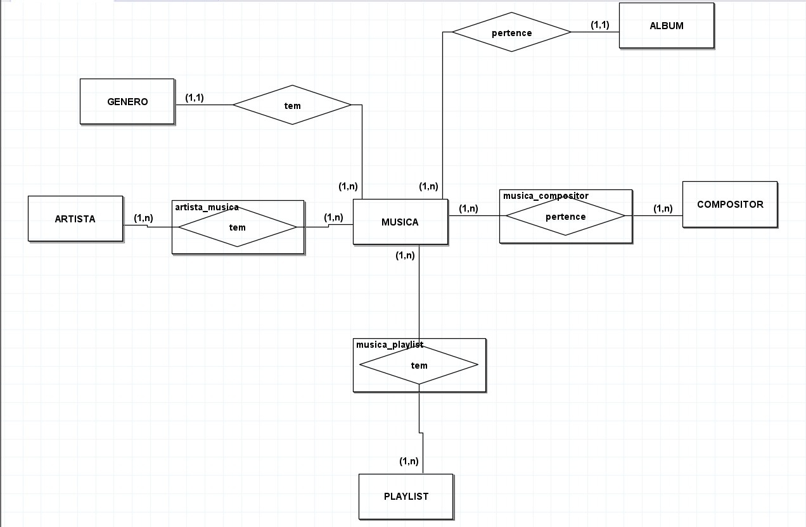
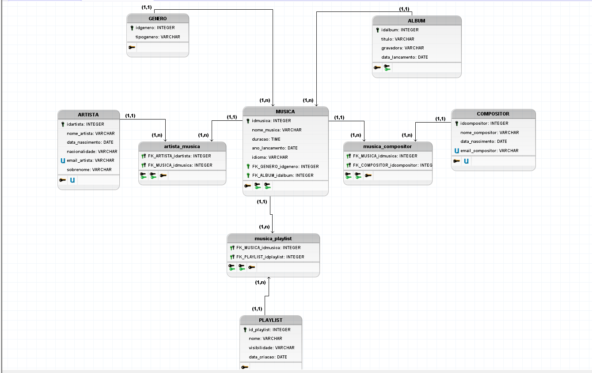

# Spoty Music

## Sobre o projeto

Este projeto foi desenvolvido como trabalho de conclusão do curso de Banco de Dados.

O objetivo foi aplicar os conhecimentos adquiridos ao longo do curso por meio da modelagem e implementação de um banco de dados para uma plataforma de streaming de músicas inspirada no Spotify.

## Estrutura do projeto

- Modelo conceitual
  
  
- Modelo lógico
  
  
- Criação das tabelas
- Procedures
- Triggers
- Consultas SQL
- Criação de usuários

## Tecnologias utilizadas

- MySQL

## Funcionalidades

- Modelagem conceitual e lógica do banco de dados.
- Criação das tabelas e relacionamentos.
- Implementação de procedures e triggers.
- Consultas SQL para manipulação e análise dos dados.
- Gerenciamento de usuários do banco de dados.
